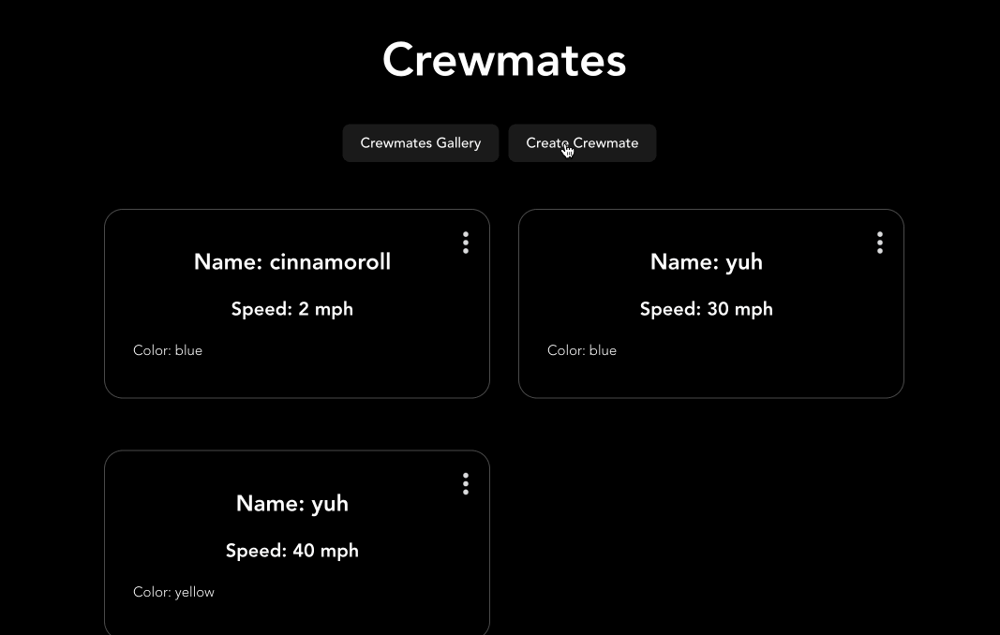

# Web Development Project 7 - *Crewmates*

Submitted by: **Ashley Oliveira Andrade**

This web app: **lets the user create a crewwmate with the following attributes: name, speed, and color. It implements CRUD. If you click on the three dots it shows info specifically about the crewmate and if you click on the pencil in the detail page you can edit the info.**

Time spent: **3** hours spent in total

## Required Features

The following **required** functionality is completed:

- [x] **A create form allows users to add new cremates**
- [x] **Users can name the crewmate and set the crewmate's attributes by clicking on one of several values**
- [x] **The site displays a summary page of all the user's added crewmates**
- [x] **A previously created crewmate can be updated from the crewmate list**
- [x] **A previously created crewmate can be deleted from the crewmate list**
- [x] **Each crewmate has a direct, unique link to an info page about them**

The following **optional** features are implemented:

- [ ] A crewmate can be given a category upon creation which restricts their attributes
- [ ] The site displays summary statistics about a user's crew on their crew page 
- [ ] The site displays a custom "success" metric about a user's crew which changes the look of the crewmate list

The following **additional** features are implemented:

* [ ] List anything else that you added to improve the site's functionality!

## Video Walkthrough

Here's a walkthrough of implemented user stories:

<!-- Replace this with whatever GIF tool you used! -->
GIF created with LICEcap 
<!-- Recommended tools:
[Kap](https://getkap.co/) for macOS
[ScreenToGif](https://www.screentogif.com/) for Windows
[peek](https://github.com/phw/peek) for Linux. -->

## Notes

This assignment was pretty similar to the lab, so it wasn't as difficult. I did have some trouble figuring out how to layout the different pages but I was able to figure it out.

## License

    Copyright 2024 Ashley Oliveira Andrade

    Licensed under the Apache License, Version 2.0 (the "License");
    you may not use this file except in compliance with the License.
    You may obtain a copy of the License at

        http://www.apache.org/licenses/LICENSE-2.0

    Unless required by applicable law or agreed to in writing, software
    distributed under the License is distributed on an "AS IS" BASIS,
    WITHOUT WARRANTIES OR CONDITIONS OF ANY KIND, either express or implied.
    See the License for the specific language governing permissions and
    limitations under the License.