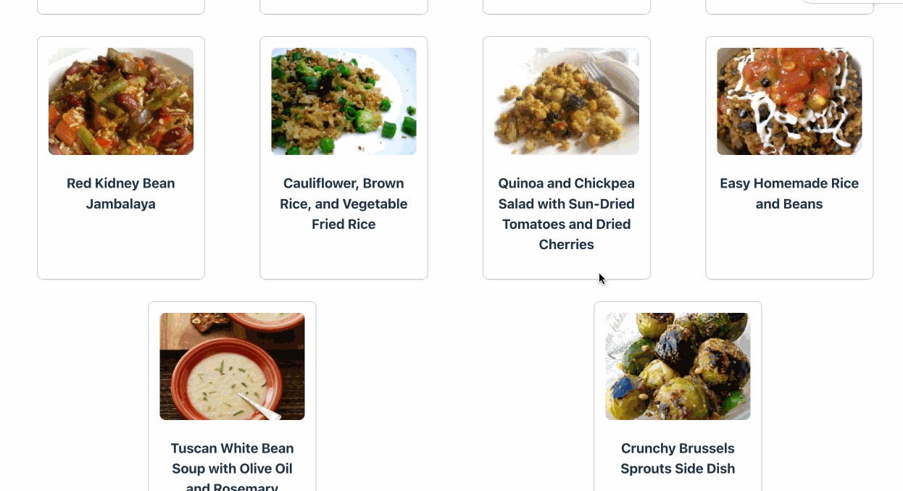

# Web Development Project 5 - *Recipe Dashboard*

Submitted by: **Ashley Oliveira Andrade**

This web app: **shows some fetched recipes using Spoonacular API, it gives some stats, and in the future it will be able to do even more.**

Time spent: **4** hours spent in total

## Required Features

The following **required** functionality is completed:

- [x] **The list displays a list of data fetched using an API call**
- [x] **Data uses the useEffect React hook and async/await syntax**
- [x] **The app dashboard includes at least three summary statistics about the data such as**
  - [x] *Total Recipes*
  - [x] *Favorite Recipes*
  - [x] *Recipes Today*
- [x] **A search bar allows the user to search for an item in the fetched data**
- [ ] **Multiple different filters (2+) allow the user to filter items in the database by specified categories**

The following **optional** features are implemented:

- [ ] Multiple filters can be applied simultaneously
- [ ] Filters use different input types such as a text input, a selection, or a slider
- [ ] The user can enter specific bounds for filter values

The following **additional** features are implemented:

* [ ] List anything else that you added to improve the site's functionality!

## Video Walkthrough

Here's a walkthrough of implemented user stories:

<!-- Replace this with whatever GIF tool you used! -->
GIF created with LICEcap  
<!-- Recommended tools:
[Kap](https://getkap.co/) for macOS
[ScreenToGif](https://www.screentogif.com/) for Windows
[peek](https://github.com/phw/peek) for Linux. -->

## Notes

This project was pretty hard, I had some issues with figuring out the different APIs and I wasn''t able to complete it fully, like the filter part of it. I am happy that I am becoming more and more familiar with fetching data with APIs.

## License

    Copyright 2024 Ashley Oliveira Andrade

    Licensed under the Apache License, Version 2.0 (the "License");
    you may not use this file except in compliance with the License.
    You may obtain a copy of the License at

        http://www.apache.org/licenses/LICENSE-2.0

    Unless required by applicable law or agreed to in writing, software
    distributed under the License is distributed on an "AS IS" BASIS,
    WITHOUT WARRANTIES OR CONDITIONS OF ANY KIND, either express or implied.
    See the License for the specific language governing permissions and
    limitations under the License.